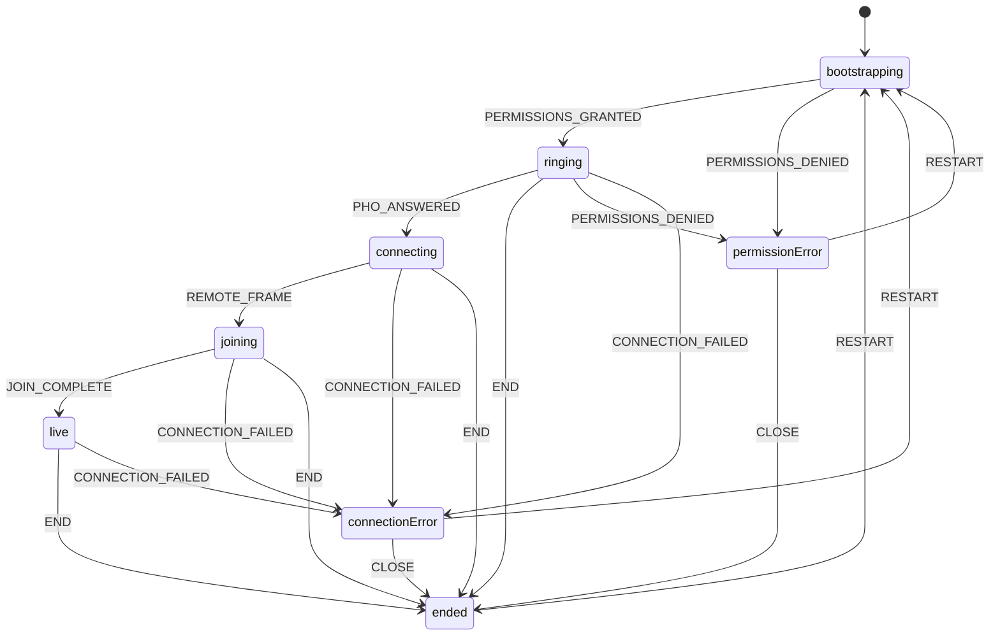

# Mini Pho — Architecture

Current runtime only. Production RTC and production signaling are not implemented.

## Entry points

| Entry | Location | Role |
|-------|----------|------|
| Bootstrap | `src/main.tsx` | Mounts React (`StrictMode` + `BrowserRouter`), loads CSS |
| Routes | `src/App.tsx` | Declares routes; builds `CallConfig`; gates controller |
| Call UI | `src/components/CallScreen.tsx` | Owns call phases, media, chrome, LiquidGL, test polling |
| Controller UI | `src/components/PhoController.tsx` | Temporary test UI for answer / end / reset |

```mermaid
flowchart LR
  main["src/main.tsx"] --> app["src/App.tsx"]
  app -->|"/call/:sessionId"| call["CallScreen.tsx"]
  app -->|"/pho-controller"| pho["PhoController.tsx"]
  call --> media["useMediaDevices"]
  call --> phases["callState reducer"]
  call --> glass["useLiquidGlass / liquidGlass"]
  call --> drag["useDraggableSelfView"]
  call --> cmds["usePhoTestCommands"]
  pho --> api["/api/test-call/*"]
  cmds --> api
  api --> store["Memory or Upstash Redis"]
```

## Active routes

| Path | Element | Notes |
|------|---------|-------|
| `/` | Redirect → `/call/demo` | |
| `/call/:sessionId` | `CallScreen` | Query: `name`, `avatar`, `remoteVideo`, `selfAvatar` (same-origin assets only) |
| `/pho-controller` | `PhoController` | Requires `VITE_ENABLE_PHO_TEST_CONTROLLER=true`; otherwise shows disabled |
| `*` | Redirect → `/call/demo` | |

Dev-only query on the call route: `debugGlass=1` (ignored outside Vite `DEV`).

## Call flow

Phases live in `src/lib/callState.ts`. `CallScreen` advances them via `callReducer` plus synchronous `phaseRef` updates for async / poll handlers.



Happy path in `CallScreen`:

1. Mount → `beginCall` → `getUserMedia` → `ringing` (local camera fullscreen).
2. Pho test `answer` (or equivalent dispatch) → `connecting` → mock remote MP4 loads.
3. First remote video frame → `joining` (layout morph).
4. After `JOIN_MORPH_MS` → `live` (self-view PiP, auto-hiding chrome).
5. End / close / errors → `ended`, `permission-error`, or `connection-error`.

Remote video is a same-origin mock asset (default `/videos/mock-agent.mp4`), not a live peer stream.

## Ownership map

| Area | Primary file |
|------|----------------|
| Routing | `src/App.tsx` |
| Call orchestration | `src/components/CallScreen.tsx` |
| Call phases | `src/lib/callState.ts` |
| Local media | `src/hooks/useMediaDevices.ts` |
| Self-view dragging | `src/hooks/useDraggableSelfView.ts` |
| Local camera surface | `src/components/LocalCameraSurface.tsx` |
| LiquidGL | `src/lib/liquidGlass.ts`, `src/hooks/useLiquidGlass.ts` |
| Test-controller commands | `src/hooks/usePhoTestCommands.ts` |
| Controller UI | `src/components/PhoController.tsx` |
| Controller HTTP client | `src/lib/phoTestControllerClient.ts` |
| Controller contracts | `src/contracts/phoTestController.ts` |
| Controller API | `api/`, `scripts/phoTestApiPlugin.ts` |
| Call chrome | `CallControlRail`, `CallControlButton`, `ContactPill`, `EffectsButton`, `SymbolIcon` |
| Styling | `src/styles/` |

## Important implementation details

### Reducer state vs refs

`phase` from `useReducer` drives renders. `phaseRef` mirrors it so media callbacks, timers, and Pho poll handlers can read the latest phase without stale closures. Dispatches and `phaseRef` updates stay paired.

### Stale media attempts

`attemptRef` in `CallScreen` and `requestGeneration` in `useMediaDevices` invalidate overlapping `beginCall` / `getUserMedia` / flip work. Late streams are stopped and discarded.

### Local camera stays mounted

During active phases the local `<video>` stays in the LiquidGL snapshot tree even when the camera is off. The track is disabled and the placeholder is shown (`data-liquid-ignore` on the video) so glass texture updates do not remount the element.

### Self-view corner persistence

`useDraggableSelfView` stores a corner name in `sessionStorage` (`mini-pho-self-view`), not pixel coordinates. Pixels are recomputed from layout, chrome visibility, and viewport so rotation and resize stay correct.

### LiquidGL pin and patch

`liquid-gl@2.0.1` is exact-pinned; `patches/liquid-gl+2.0.1.patch` is applied via `patch-package`. Private renderer fields and stale-video erase logic are version-locked. Exactly one shared WebGL canvas is adopted into `.liquid-canvas-layer`. CSS frosted fallback runs when WebGL is missing, init fails, reduced transparency is preferred, or `__miniPhoForceGlassFallback__` is set. See `docs/liquid-gl-verification.md`.

### Controller command queue and ack

Commands are stored with a monotonic `revision`. The call client polls, applies each new revision once (tracked in session storage), then POSTs `/api/test-call/ack` with the resulting phase. The controller UI waits for that acknowledgement (15s timeout) and never treats a successful POST alone as “applied.” See `docs/mini-pho-test-controller.md`.

## Active versus unused components

**Mounted on active routes**

`CallScreen`, `LocalCameraSurface`, `CallControlRail`, `CallControlButton`, `ContactPill`, `EffectsButton` (decorative), `EndedScreen`, `CameraActivationFallback`, `SymbolIcon`, `PhoController`.

**Present in the repo but not imported by active routes**

`ConnectingScreen`, `PrejoinScreen`, `SelfView`, `StatusPill`, `MoreSheet`, `ParticipantSheet`, `EffectsPanel`.

Also unused at runtime: `src/lib/photonAppCard.ts` (helper only). `More` in the control rail is rendered but disabled.

## Tests (subsystem map)

| Area | Tests |
|------|-------|
| Phases / config parsing | `src/tests/unit/callState.test.ts` |
| Media / auto-hide / timer | `src/tests/unit/hooks.test.ts` |
| LiquidGL controller | `src/tests/unit/liquidGlass.test.ts`, `useLiquidGlass.test.tsx` |
| Call chrome / symbols | `src/tests/unit/callControls.test.tsx`, `symbolIcon.test.tsx` |
| Pho client + mapping | `src/tests/unit/phoTestControllerClient.test.ts`, `phoTestCommands.test.ts` |
| Pho API | `api/tests/phoTestApi.test.ts` |

Manual LiquidGL checks: `docs/liquid-gl-verification.md`.
