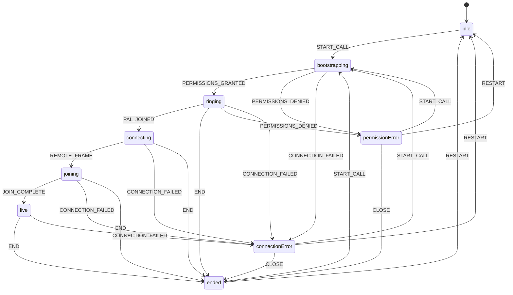

# Mini Pho — Architecture

Current runtime: FaceTime UI + Tavus CVI over Daily.

## Entry points

| Entry | Location | Role |
|-------|----------|------|
| Bootstrap | `src/main.tsx` | Mounts React (`StrictMode` + `BrowserRouter`), loads CSS |
| Routes | `src/App.tsx` | Declares routes; builds `CallConfig` |
| Call UI | `src/components/CallScreen.tsx` | Owns call phases, chrome, LiquidGL, Tavus lifecycle wiring |
| Launcher | `src/components/CallLauncher.tsx` | Idle “Talk to Gary” Call button |

```mermaid
flowchart LR
  main["src/main.tsx"] --> app["src/App.tsx"]
  app -->|"/call/:sessionId"| call["CallScreen.tsx"]
  call --> launcher["CallLauncher"]
  call --> tavusHook["useTavusCall"]
  call --> phases["callState reducer"]
  call --> glass["useLiquidGlass / liquidGlass"]
  call --> drag["useDraggableSelfView"]
  tavusHook --> media["useMediaDevices"]
  tavusHook --> client["tavus-client"]
  tavusHook --> daily["@daily-co/daily-js"]
  client --> api["POST /api/tavus"]
  api --> handler["handleTavusRequest"]
```

## Active routes

| Path | Element | Notes |
|------|---------|-------|
| `/` | Redirect → `/call/demo` | |
| `/call/:sessionId` | `CallScreen` | Query: `name`, `avatar`, `selfAvatar` (same-origin assets only). No remote room URL params. |
| `*` | Redirect → `/call/demo` | |

Dev-only query on the call route: `debugGlass=1` (ignored outside Vite `DEV`).

## Call flow

Phases live in `src/lib/callState.ts`. `CallScreen` advances them via `callReducer` plus synchronous `phaseRef` updates for async handlers.



Happy path in `CallScreen`:

1. Idle launcher → Call → `START_CALL` / `startCall()`.
2. Local camera + Tavus create run together → `ringing` once permissions succeed.
3. Join Daily room with `conversation_url` + `meeting_token`.
4. Gary joins → `PAL_JOINED` → `connecting`.
5. First remote video frame → `joining` (layout morph) → `live`.
6. End → Tavus End Conversation + Daily leave/destroy → `ended`.

Unexpected disconnect cleanup is owned by Tavus `participant_left_timeout: 10`.
No browser unload End / beacon.

## Ownership map

| Area | Primary file |
|------|----------------|
| Routing | `src/App.tsx` |
| Call orchestration | `src/components/CallScreen.tsx` |
| Call phases | `src/lib/callState.ts` |
| Tavus + Daily lifecycle | `src/hooks/useTavusCall.ts` |
| Local media | `src/hooks/useMediaDevices.ts` |
| Self-view dragging | `src/hooks/useDraggableSelfView.ts` |
| Local camera surface | `src/components/LocalCameraSurface.tsx` |
| LiquidGL | `src/lib/liquidGlass.ts`, `src/hooks/useLiquidGlass.ts` |
| Tavus browser client | `src/lib/tavus/tavus-client.ts` |
| Tavus server handler | `src/lib/tavus/tavus-api-vite-ssr.ts` |
| Tavus Vite middleware | `scripts/tavusApiPlugin.ts` |
| Tavus Vercel adapter | `api/tavus.ts` |
| Call chrome | `CallControlRail`, `CallControlButton`, `ContactPill`, `EffectsButton`, `SymbolIcon` |
| Styling | `src/styles/` |

## Important implementation details

### Reducer state vs refs

`phase` from `useReducer` drives renders. `phaseRef` mirrors it so media callbacks and timers can read the latest phase without stale closures. Dispatches and `phaseRef` updates stay paired.

### Stale media attempts

`attemptRef` in `CallScreen` and `requestGeneration` in `useMediaDevices` invalidate overlapping `beginCall` / `getUserMedia` / flip work. Late streams are stopped and discarded.

### Local camera stays mounted

During active phases the local `<video>` stays in the LiquidGL snapshot tree even when the camera is off. The track is disabled and the placeholder is shown (`data-liquid-ignore` on the video) so glass texture updates do not remount the element.

### Self-view corner persistence

`useDraggableSelfView` stores a corner name in `sessionStorage` (`mini-pho-self-view`), not pixel coordinates. Pixels are recomputed from layout, chrome visibility, and viewport so rotation and resize stay correct.

### Call audio (FaceTime SFX)

Shared `CallAudioController` (`src/lib/callAudio.ts`) + `useCallAudio` maps phases to public WAVs under `/audio/facetime/`. Wired from both `CallScreen` and `PhoCallScreen`: `ringing` loops until remote join (`connecting` plays connected once), `ended` plays once per call, mic mute/unmute one-shots follow `audioEnabled`.

### LiquidGL pin and patch

`liquid-gl@2.0.1` is exact-pinned; `patches/liquid-gl+2.0.1.patch` is applied via `patch-package`. Private renderer fields and stale-video erase logic are version-locked. Exactly one shared WebGL canvas is adopted into `.liquid-canvas-layer`. CSS frosted fallback runs when WebGL is missing, init fails, reduced transparency is preferred, or `__miniPhoForceGlassFallback__` is set. See `docs/liquid-gl-verification.md`.

### Tavus secrets

`TAVUS_API_KEY` is server-only. Create always overrides browser params with fixed PAL / Face / timeout values. Meeting tokens stay in memory for Daily `join` only.

## Active versus unused components

**Mounted on active routes**

`CallScreen`, `CallLauncher`, `LocalCameraSurface`, `CallControlRail`, `CallControlButton`, `ContactPill`, `EffectsButton` (decorative), `EndedScreen`, `CameraActivationFallback`, `SymbolIcon`.

**Present in the repo but not imported by active routes**

`ConnectingScreen`, `PrejoinScreen`, `SelfView`, `StatusPill`, `MoreSheet`, `ParticipantSheet`, `EffectsPanel`.

Also unused at runtime: `src/lib/photonAppCard.ts` (helper only). `More` in the control rail is rendered but disabled.

## Tests (subsystem map)

| Area | Tests |
|------|-------|
| Phases / config parsing | `src/tests/unit/callState.test.ts` |
| Media / auto-hide / timer | `src/tests/unit/hooks.test.ts` |
| Call audio (FaceTime SFX) | `src/tests/unit/callAudio.test.ts` |
| Tavus + Daily hook | `src/tests/unit/useTavusCall.test.tsx` |
| LiquidGL controller | `src/tests/unit/liquidGlass.test.ts`, `useLiquidGlass.test.tsx` |
| Call chrome / symbols | `src/tests/unit/callControls.test.tsx`, `symbolIcon.test.tsx` |
| Tavus API | `api/tests/tavusApi.test.ts` |

Manual LiquidGL checks: `docs/liquid-gl-verification.md`.
Manual Tavus checks: `docs/tavus-cvi.md`.
