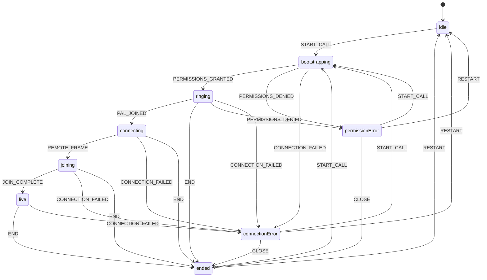

# Mini Pho — Architecture

Current runtime: FaceTime UI + Tavus CVI over Daily.

## C4 diagrams

| Level | File |
|-------|------|
| Context | [`docs/architecture/c4-context.md`](docs/architecture/c4-context.md) |
| Containers | [`docs/architecture/c4-containers.md`](docs/architecture/c4-containers.md) |
| Dynamic (live call) | [`docs/architecture/c4-dynamic-live-call.md`](docs/architecture/c4-dynamic-live-call.md) |
| Deployment | [`docs/architecture/c4-deployment.md`](docs/architecture/c4-deployment.md) |

## Entry points

| Entry | Location | Role |
|-------|----------|------|
| Bootstrap | `src/main.tsx` | Mounts React (`StrictMode` + `BrowserRouter`), loads CSS |
| Routes | `src/App.tsx` | `/` → `/call/garry-tan`; `/call/:agentId` live or busy call; exit → `HIRE_ME_URL` |
| Call UI | `src/components/CallScreen.tsx` | Presentation + LiquidGL; phases via `useCallLifecycle` |
| Call visual shell | `src/components/CallVisualShell.tsx` | Shared stage / canvas / chrome slots for live + busy |
| Busy call | `src/components/BusyCallScreen.tsx` | Local-only ring → busy; never Tavus/Daily |

```mermaid
flowchart LR
  main["src/main.tsx"] --> app["src/App.tsx"]
  app -->|"/"| redirect["Navigate to /call/garry-tan"]
  redirect --> route["AgentCallRoute"]
  app -->|"/call/:agentId"| route
  route -->|Garry live| call["CallScreen.tsx"]
  route -->|busy| busy["BusyCallScreen"]
  route -->|onExit| hire["HIRE_ME_URL"]
  busy --> mediaBusy["useMediaDevices"]
  busy --> audioBusy["useCallAudio"]
  call --> tavusHook["useTavusCall"]
  call --> phases["callState reducer"]
  call --> glass["useLiquidGlass / liquidGlass"]
  call --> drag["useDraggableSelfView"]
  tavusHook --> media["useMediaDevices"]
  tavusHook --> client["tavus-client"]
  tavusHook --> daily["@daily-co/daily-js"]
  client --> api["POST /api/tavus"]
  api --> handler["handleTavusRequest"]
```

## Active routes

| Path | Element | Notes |
|------|---------|-------|
| `/` | `Navigate` → `/call/garry-tan` | Direct Garry landing (no agent directory) |
| `/call/:agentId` | `AgentCallRoute` | Resolves fixed agent data; Garry → `CallScreen` (auto-start); others → `BusyCallScreen`. Unknown ids → `/`. Exit uses `window.location.replace(HIRE_ME_URL)`. Profile identity is never taken from query params. |
| `*` | Redirect → `/` | |

Dev-only query on Garry’s call route: `debugGlass=1` (ignored outside Vite `DEV`).

## Call flow

Phases live in `src/lib/callState.ts`. `useCallLifecycle` advances them via `callReducer` through an atomic `advance()` that updates `phaseRef` with each dispatch.



Happy path in `CallScreen`:

1. `/` → `/call/garry-tan` → auto `START_CALL` / `startCall()`.
2. Local camera + Tavus create run together → `ringing` once permissions succeed.
3. Join Daily room with `conversation_url` + `meeting_token`.
4. Gary joins → `PAL_JOINED` → `connecting`.
5. First remote video frame → `joining` (layout morph) → `live`.
6. End → await Tavus End Conversation + Daily leave/destroy → `window.location.replace(HIRE_ME_URL)` (`https://pleasegivemeaninternship.com`).

Unexpected disconnect cleanup is owned by Tavus `participant_left_timeout: 10`.
No browser unload End / beacon.

## Ownership map

| Area | Primary file |
|------|----------------|
| Routing | `src/App.tsx` |
| Call orchestration | `src/hooks/useCallLifecycle.ts` |
| Call presentation | `src/components/CallScreen.tsx`, `CallVisualShell.tsx` |
| Call phases | `src/lib/callState.ts` |
| Tavus + Daily lifecycle | `src/hooks/useTavusCall.ts` |
| Local media | `src/hooks/useMediaDevices.ts` |
| Self-view dragging | `src/hooks/useDraggableSelfView.ts` |
| Local camera surface | `src/components/LocalCameraSurface.tsx` |
| LiquidGL | `src/lib/liquidGlass.ts`, `src/hooks/useLiquidGlass.ts` |
| Tavus browser client | `src/lib/tavus/tavus-client.ts` |
| Tavus server handler | `src/lib/tavus/tavus-api-vite-ssr.ts` |
| Tavus Vite middleware | `scripts/tavusApiPlugin.ts` |
| Tavus Vercel adapter | `api/tavus.ts` |
| Call chrome | `CallControlRail`, `CallControlButton`, `ContactPill`, `EffectsButton`, `SymbolIcon` |
| Agent directory data | `src/data/agents.ts`, `src/data/homeLinks.ts` (`HIRE_ME_URL`) |
| LiquidGL | `liquidGlass.ts`, `useLiquidGlass` |
| Styling | `src/styles/` |

## Important implementation details

### Reducer state vs refs

`phase` from `useReducer` drives renders. `useCallLifecycle` keeps a `phaseRef` updated only through `advance(action)` so media callbacks and timers read the latest phase without stale closures.

### Stale media attempts

`attemptRef` in `useCallLifecycle` and `requestGeneration` in `useMediaDevices` invalidate overlapping `beginCall` / `getUserMedia` / flip work. Late streams are stopped and discarded. Camera flip failures use `cameraActionError` (recoverable) and never the fatal media / connection error path.

`useTavusCall.endCall` is single-flight (`endInFlightRef`): it captures the Daily call + conversation being torn down, and `startCall` awaits that promise (and the Daily teardown chain) before creating another call object — so Retry cannot destroy a newly created session.

### Local camera stays mounted

During active phases the local `<video>` stays in the LiquidGL snapshot tree even when the camera is off. The track is disabled and the placeholder is shown (`data-liquid-ignore` on the video) so glass texture updates do not remount the element.

### Self-view corner persistence

`useDraggableSelfView` stores a corner name in `sessionStorage` (`mini-pho-self-view`), not pixel coordinates. Pixels are recomputed from layout, chrome visibility, and viewport so rotation and resize stay correct.

### Call audio (FaceTime SFX)

Shared `CallAudioController` (`src/lib/callAudio.ts`) + `useCallAudio` maps phases to public WAVs under `/audio/facetime/`. Wired from `CallScreen` and `BusyCallScreen`: `ringing` loops until remote join (`connecting` plays connected once), `ended` plays once per call, mic mute/unmute one-shots follow `audioEnabled`.

### LiquidGL pin and patch

`liquid-gl@2.0.1` is exact-pinned; `patches/liquid-gl+2.0.1.patch` is applied via `patch-package`. The patched renderer rescans eligible `<video>` nodes each `_updateDynamicVideos()` tick, composites them with opacity-aware blits into one shared WebGL canvas (adopted into `.liquid-canvas-layer`), and exposes `_rebuildDynamicVideoTexture()` for post-snapshot rebuilds. Unmarked videos keep the renderer’s normal direct-blit / Canvas2D eligibility. The Tavus remote video is intentionally marked `data-liquid-video-upload="canvas"` so it always uses Canvas2D — a browser/WebRTC video-to-WebGL texture compatibility choice confirmed by runtime A/B testing (direct opaque blit could leave black texture pixels after settled rebuilds). Phase / layout / camera commits only call `refreshImmediate()` (lens metrics). Self-view morph frames also update metrics only; morph `onFinish` schedules one debounced `recapture()` (await snapshot, then rebuild videos). Camera-off, visibility, and orientation still recapture. CSS frosted fallback runs when WebGL is missing, init fails, reduced transparency is preferred, or `__miniPhoForceGlassFallback__` is set. See `docs/liquid-gl-verification.md`.

### Tavus secrets

`TAVUS_API_KEY` is server-only. Create always overrides browser params with fixed PAL / Face / timeout values. Meeting tokens stay in memory for Daily `join` only.

## Active versus unused components

**Mounted on active routes**

`CallScreen`, `BusyCallScreen`, `CallVisualShell`, `LocalCameraSurface`, `CallControlRail`, `CallControlButton`, `ContactPill`, `EffectsButton` (decorative), `SymbolIcon`.

**Present in the repo but not imported by active routes**

`ConnectingScreen`, `PrejoinScreen`, `SelfView`, `StatusPill`, `MoreSheet`, `ParticipantSheet`, `EffectsPanel`.

Also unused at runtime: `src/lib/photonAppCard.ts` (helper only). `More` in the control rail is rendered but disabled.

## Tests (subsystem map)

| Area | Tests |
|------|-------|
| Phases / config parsing | `src/tests/unit/callState.test.ts` |
| Media / auto-hide / timer | `src/tests/unit/hooks.test.ts` |
| Call audio (FaceTime SFX) | `src/tests/unit/callAudio.test.ts` |
| Tavus + Daily hook | `src/tests/unit/useTavusCall.test.tsx` |
| Call lifecycle | `src/tests/unit/useCallLifecycle.test.tsx` |
| LiquidGL controller / dynamic video / morph | `src/tests/unit/liquidGlass.test.ts`, `useLiquidGlass.test.tsx`, `liquidGlDynamicVideos.test.ts`, `useLayoutMorph.test.ts` |
| Call chrome / symbols | `src/tests/unit/callControls.test.tsx`, `symbolIcon.test.tsx` |
| Tavus API | `api/tests/tavusApi.test.ts` |

Manual LiquidGL checks: `docs/liquid-gl-verification.md`.
Manual Tavus checks: `docs/tavus-cvi.md`.
