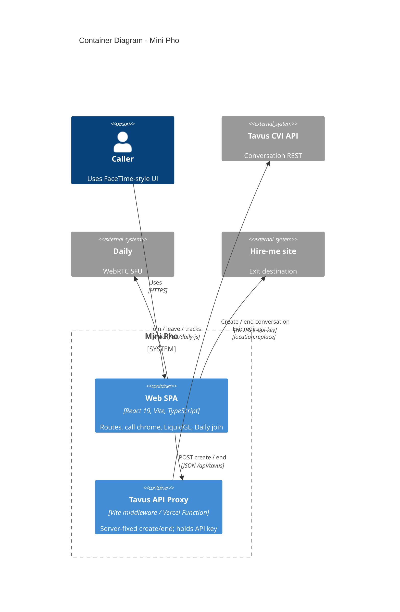

# C4 Containers — Mini Pho

Deployable / runtime containers inside Mini Pho.

## Container map

| Container | Code | Role |
|-----------|------|------|
| Web SPA | `src/` | Routes (`App.tsx`), `CallScreen` / `BusyCallScreen`, hooks, LiquidGL |
| Tavus API Proxy | `src/lib/tavus/tavus-api-vite-ssr.ts`, `scripts/tavusApiPlugin.ts`, `api/tavus.ts` | Shared handler; Vite in dev, Vercel in prod |

## Out of scope here

Agent directory data (`src/data/agents.ts`) drives `/call/:agentId` only —
there is no mounted home grid UI. See [`ARCHITECTURE.md`](../../ARCHITECTURE.md).
