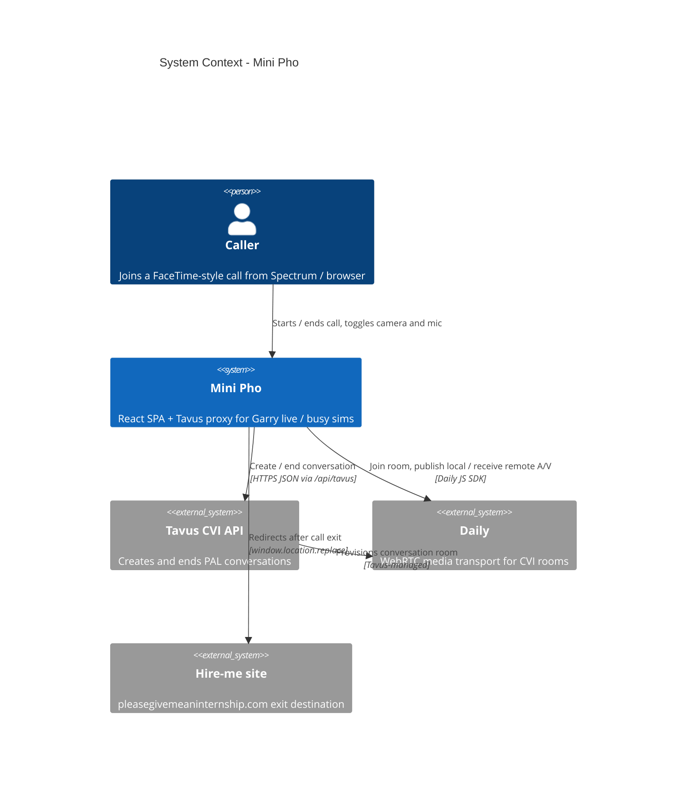

# C4 Context — Mini Pho

System context for Mini Pho: FaceTime-style video UI inside Photon Spectrum /
iMessage, connected to Tavus CVI (Gary) over Daily.

Runtime ownership and call phases: [`ARCHITECTURE.md`](../../ARCHITECTURE.md).

## Notes

- Browser never receives `TAVUS_API_KEY`, PAL IDs, face IDs, or room URLs as
  trusted client input — create payload is server-fixed.
- Unexpected disconnect cleanup is owned by Tavus `participant_left_timeout`
  (no End Conversation from `beforeunload` / beacon).
