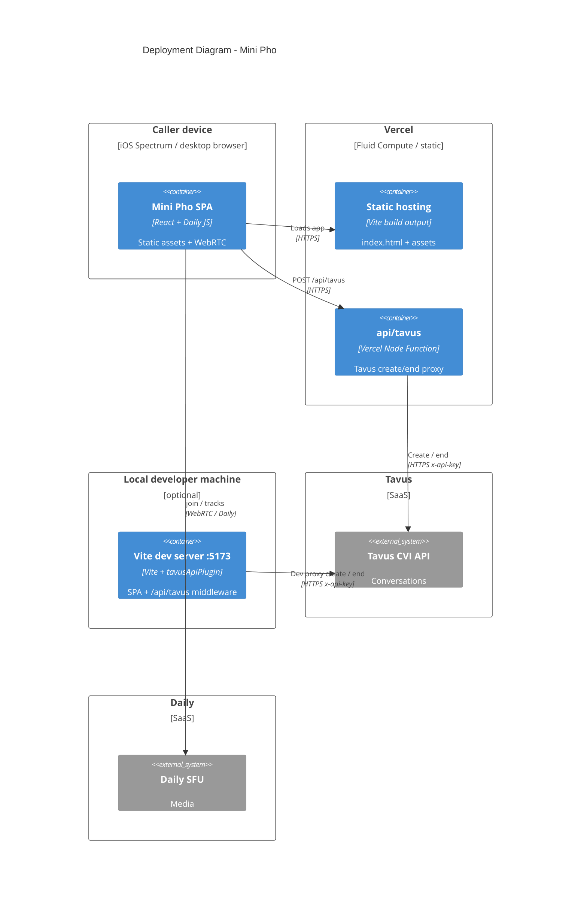

# C4 Deployment — Mini Pho

Production and local deployment nodes.

## Environment

| Variable | Where | Notes |
|----------|-------|-------|
| `TAVUS_API_KEY` | Server only | Never `VITE_*` |
| `TAVUS_PAL_ID` | Server only | Fixed Gary PAL |
| `TAVUS_FACE_ID` | Server only | Optional |
| `TAVUS_TEST_MODE` | Shell / server | Defaults `true` when unset in Vite |

See [`.env.example`](../../.env.example) and [`docs/tavus-cvi.md`](../tavus-cvi.md).
