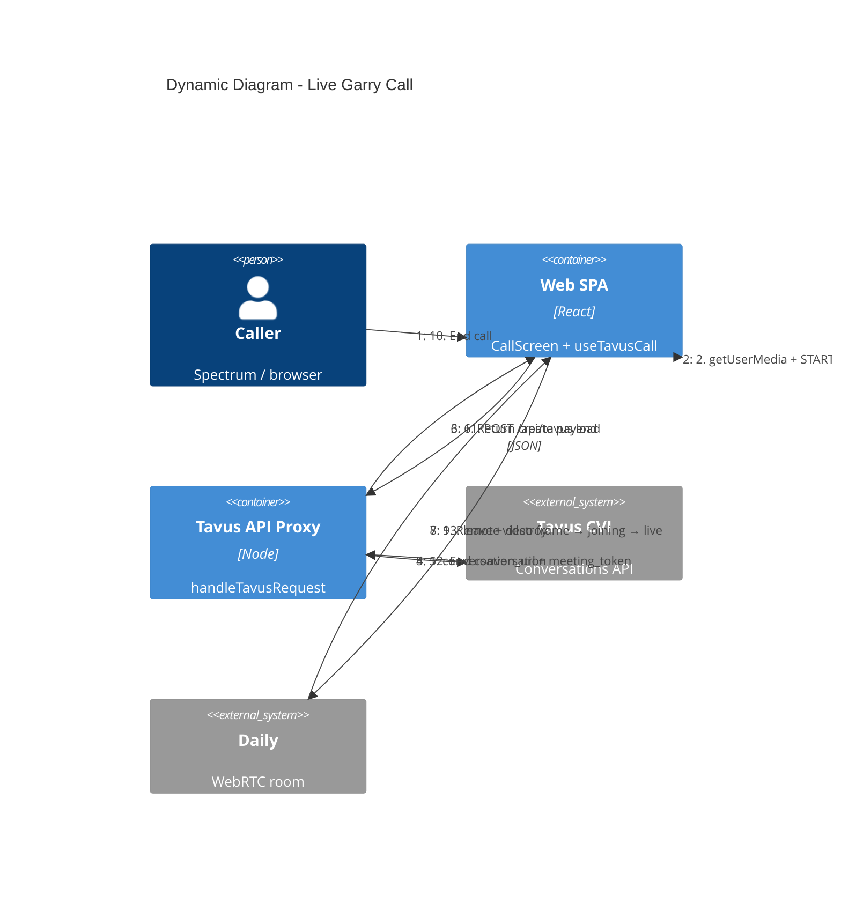

# C4 Dynamic — Live Garry call

Numbered request / event flow for the happy-path live call
(`/` → `/call/garry-tan` → auto-start).

Phase machine details: [`ARCHITECTURE.md`](../../ARCHITECTURE.md) and
`src/lib/callState.ts`.

## Phase mapping

| Step | Reducer signal |
|------|----------------|
| Permissions OK | `PERMISSIONS_GRANTED` → `ringing` |
| Gary joins Daily | `PAL_JOINED` → `connecting` |
| First remote frame | `REMOTE_FRAME` → `joining` |
| Morph complete | `JOIN_COMPLETE` → `live` |
| User hangs up | `END` → teardown → hire-me redirect |
